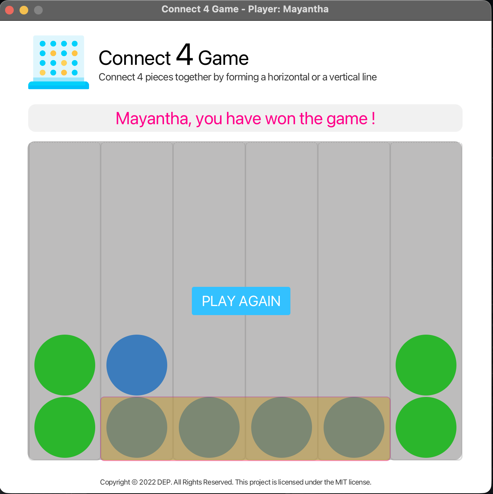
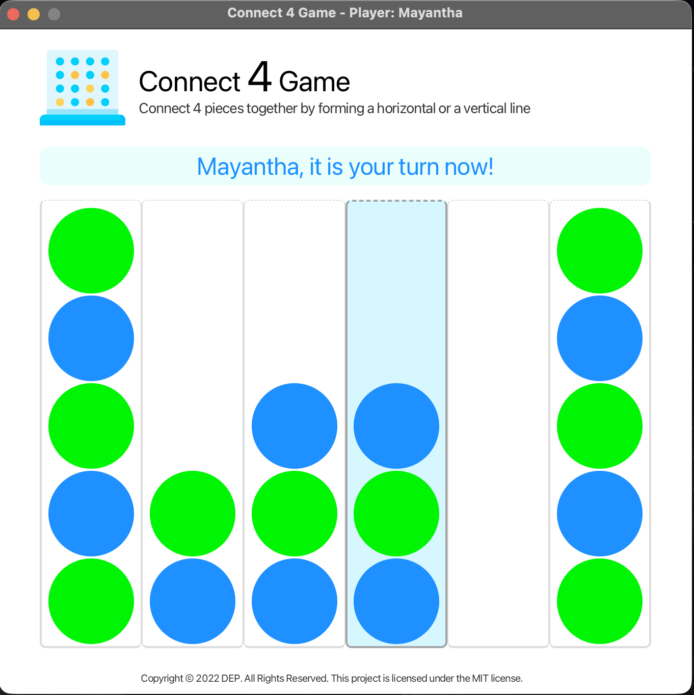

# Connect 4 Game – OOP Coursework

A **Connect 4** desktop game built with **JavaFX**, developed as an **Object-Oriented Programming (OOP)** coursework assignment.  
Players take turns dropping colored discs into a vertical grid. The first to connect **4 pieces** horizontally or vertically wins. The game includes a **Human vs AI** mode with artificial intelligence for the computer player.

---

## Features

- **Player setup** – Enter your name before starting
- **Human vs AI** – Play against the computer
- **Turn-based gameplay** – Clear turn indicators
- **Win detection** – Horizontal and vertical 4-in-a-row
- **Highlight winning line** – Winning pieces are marked
- **Play again** – Restart after a win or draw
- **Modern UI** – Clean JavaFX interface with CSS styling
- **OOP design** – Interfaces, inheritance, and polymorphism (Player hierarchy, Board, Piece, Winner)

---

## Screenshots

### Gameplay


### Winner Screen


---

## Tech Stack

| Component        | Technology                |
|------------------|---------------------------|
| Language         | Java                      |
| UI Framework     | JavaFX                    |
| Build Tool       | Maven                     |
| Architecture     | OOP (Interfaces + Classes)|
| Styling          | CSS                       |

---

## Game Rules

1. Players take turns dropping a disc into one of the 6 columns.
2. The disc falls to the lowest available row in that column.
3. The first player to get **four discs in a row** (horizontal or vertical) wins.
4. If the board fills with no winner, the game is a draw.
5. Click **PLAY AGAIN** to start a new game.

---

## Project Structure

```
connect-four-game-assignment-main/
├── src/main/java/lk/ijse/dep/
│   ├── AppInitializer.java / Launcher.java   # Application entry
│   ├── controller/
│   │   ├── CreatePlayerController.java       # Name entry screen
│   │   └── BoardController.java              # Game board UI logic
│   ├── service/                              # Core game logic (OOP)
│   │   ├── Board.java / BoardImpl.java       # Board interface & implementation
│   │   ├── BoardUI.java                      # UI callback interface
│   │   ├── Player.java                       # Abstract player
│   │   ├── HumanPlayer.java                  # Human player
│   │   ├── AiPlayer.java                     # AI player
│   │   ├── Piece.java                        # EMPTY / GREEN / BLUE
│   │   └── Winner.java                       # Winner result
│   └── util/
│       └── DEPAlert.java
├── src/main/resources/
│   ├── view/          # FXML (CreatePlayer, Board)
│   ├── style/         # CSS
│   └── asset/         # Images
├── pom.xml
└── README.md
```

---

## OOP Concepts Used

| Concept              | Where it is applied                          |
|----------------------|----------------------------------------------|
| **Interface**        | `Board`, `BoardUI`                           |
| **Abstract class**   | `Player`                                     |
| **Inheritance**      | `HumanPlayer`, `AiPlayer` extend `Player`    |
| **Polymorphism**     | Player moves via common `Player` reference   |
| **Encapsulation**    | Board state (`Piece[][]`) hidden in `BoardImpl` |
| **Enum**             | `Piece` (EMPTY, GREEN, BLUE)                 |

---

## How to Run

### Prerequisites
- **JDK 11** or higher
- **Maven 3.6+**

### Run with Maven

```bash
# Clone / open the project
cd connect-four-game-assignment-main

# Run the game
mvn clean javafx:run
```

### Run with IDE (IntelliJ)

1. Open the `pom.xml` as a project.
2. Reload Maven dependencies.
3. Create a Maven run configuration with command: `javafx:run`
4. Run the configuration.

**Main class:** `lk.ijse.dep.Launcher`

---

## How to Play

1. Enter your name on the start screen.
2. Click a column to drop your disc (green).
3. The AI plays automatically (blue).
4. First to connect 4 wins!
5. Click **PLAY AGAIN** to restart.

---

## Author

**G. D. Mayantha**  
GitHub: [Mayantha2003](https://github.com/Mayantha2003)

**Course:** Object-Oriented Programming (OOP) – IJSE / DEP

---

## License

Copyright © 2022 DEP. All Rights Reserved.  
This project is licensed under the [MIT](LICENSE.txt) License.
